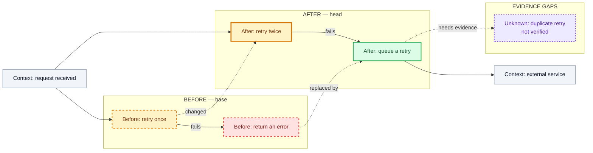

# Behavior Diff

Show the semantic difference between the old and new system behavior. Use this for a working-tree diff, staged change, commit, commit range, branch, or PR. Do not edit code and do not decide whether the change is correct; make the change easier to understand.

## Set the boundary

Identify the exact base and head before drawing:

- working-tree or staged changes: compare with `HEAD`;
- one commit: compare it with its parent;
- a range, branch, or PR: use the requested base and head, or the stated merge-base.

State the system scope and the evidence used. If it is unclear, ask one short question. Separate facts, inferences, and unknowns. Do not imply that a focused diagram covers the whole system.

Use one focused diagram by default. Add another diagram only when the first one cannot explain both the behavior change and its impact. If the user asks for a broader view, state the chosen scope in one sentence, for example:

`Diagram scope: focused (the change adds a branch between request processing and an external service, so I will show the old and new paths plus their failure outcomes).`

Choose the smallest set of maps that explains the change. Do not make the user choose a review depth here; `code-review` owns that decision when the user is doing a full review.

## Build the semantic map

Inspect the changed code and enough callers, callees, tests, and external boundaries to explain the system behavior. Choose only the map or maps that reveal the important difference:

Model the system in terms of inputs, decisions, state changes, outputs, side effects, and boundaries. Prefer names a user, operator, or downstream system would recognize.

- a system-impact map: changed behavior → dependent behavior → state, data, external systems, and operators;
- a behavior-flow map: old and new branches → outcomes, errors, and side effects;
- a state or data-flow map: old and new transitions, events, writes, or reads.

Show the before and after clearly. Mark nodes and edges as added, removed, changed, context, or unknown. Keep unchanged system context small. Keep internal file names and symbols out of the chart unless they are themselves a user-visible system surface. Put supporting evidence in the prose only when it helps explain a behavior or unknown. Use a second small diagram instead of one giant graph when control flow and system impact are both important.

### Name the two sides

- Use `Before:` for behavior from the base and `After:` for behavior from the head. Put the prefix first in every side-specific label.
- Use `OLD_...` and `NEW_...` as Mermaid node IDs. These IDs make references unambiguous; the visible label should still use `Before:` or `After:`.
- Give corresponding nodes the same semantic name after the prefix, then describe the difference. For example: `Before: retry policy — once` and `After: retry policy — twice`.
- Name the real behavior, branch, state, or boundary. Do not use vague labels such as `old branch`, `new branch`, or `changed node`.
- Put `BEFORE — base` on the left and `AFTER — head` on the right when the layout permits. Keep corresponding paths in the same order.
- Use `Context:` for unchanged system behavior shared by both sides, and `Unknown:` for behavior that has not been verified. Do not duplicate unchanged context just to label it as old and new.

### Write readable chart text

Write visible chart text in plain, compact language. Use short active phrases and familiar words; remove filler and repeated context. Use system and domain terms the user can act on. Keep exact API names, commands, and error text only when they describe a visible system surface or outcome. Do not put internal file names or symbols in the chart.

Treat each node as a signpost, not a paragraph:

- Put one behavior, decision, state, or boundary in each node. If a label contains two actions joined by `and`, split it unless the text is an exact identifier or quote.
- Put the status prefix on the first line, the behavior on the second line, and a system boundary or outcome on a third line only when needed.
- Use explicit ` ` breaks at meaning boundaries instead of relying on automatic wrapping. Aim for two lines and allow no more than three; keep each line to roughly 40 characters or fewer where practical. Shorten the wording or split the node when it does not fit.
- Keep branch outcomes on edges with short labels such as `hit`, `miss`, `fails`, `returns 202`, or `writes file`. Aim for one or two words and use no more than three; use `needs evidence` without extra detail. Move any longer edge explanation into a node or the prose below the chart.
- Do not put arrows, long lists, multiple clauses, or several system boundaries inside one label. Do not use internal identifiers as a substitute for plain-language behavior.
- If the chart is still crowded after shortening labels, split it into two focused diagrams. Do not solve crowding by shrinking the meaning into smaller text or removing the boundary.

### Make boundaries visible

- Put the old and new flows in `subgraph BEFORE["BEFORE — base"]` and `subgraph AFTER["AFTER — head"]`. Use `direction TB` inside a side when it has branches.
- Put shared context before the two subgraphs and every `Unknown:` node inside a clearly named evidence-gap area. Do not duplicate shared context inside both sides.
- Add a system or data-boundary subgraph only when it reduces ambiguity. Give every subgraph a visible title, keep subgraphs to one nesting level, and label them with plain domain names.
- Keep corresponding stages in the same order. Minimize crossing edges; label a cross-boundary edge when it represents a changed route, event, or data dependency.
- Split the diagram when one side contains more than about eight meaningful nodes, crosses several concerns, or needs many long cross-boundary edges to be understood.

### Color and line rules

Use text and line style as well as color, so the diagram remains understandable when color is unavailable:

| Mark | Meaning |
| --- | --- |
| red fill + dashed border | `Before:` behavior removed from the head |
| green fill + solid border | `After:` behavior added in the head |
| amber fill + dashed border | `Before:` half of a changed behavior |
| amber fill + solid border | `After:` half of a changed behavior |
| slate fill + normal border | `Context:` unchanged behavior |
| purple fill + dotted border | `Unknown:` unverified behavior or impact |

Use color for change status, not for good or bad. Always keep the `Before:`/`After:` or `Context:`/`Unknown:` text; never make color the only difference. Solid arrows show execution or data flow. Dashed arrows connect corresponding old and new nodes or mark a missing evidence link, and should be labeled `changed`, `replaced by`, or `needs evidence`.

Mermaid is the default output. Use `classDef` so the diagram has diff-like colors. Keep the labels readable even when the diagram is viewed without color:

Use the rules above consistently. Label edges when the important change is a branch, route, event, or data dependency. Do not color unchanged behavior as added or removed.

Before returning the chart, run a readability pass:

1. Read only the node labels. Can a reader identify each step without reading a paragraph?
2. Read only the edge labels. Does each branch say what happened in one or two words?
3. Trace the `Before:` path, then the `After:` path. Are the changed stages aligned and bounded?
4. Check the smallest view. If the paths or labels merge at a glance, shorten or split the diagram.

## Explain the diagram

After the diagram, explain in plain language:

- what changed in the main path;
- which branch, state, data, boundary, or side effect is new or gone;
- what the diagram does not prove and what evidence is missing;
- which system behavior or boundary deserves attention.

Keep the output flexible. A short change may need one diagram and three sentences; a cross-module change may need two diagrams and a short risk note. Inline Mermaid is the default. Write a `.mmd` file only when the user asks for one. Use the requested path; if none is given, choose a new descriptive path in the current workspace and state it. Do not overwrite an existing file without permission. If the user asks for a separate CSS file, keep the Mermaid class names and color rules aligned with the diagram.
